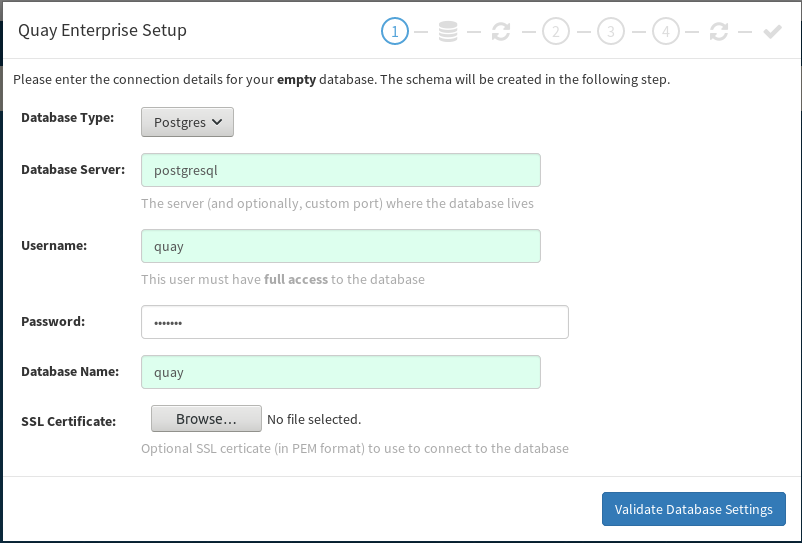
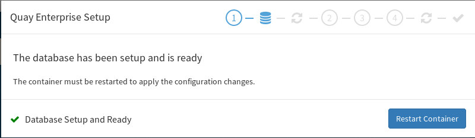
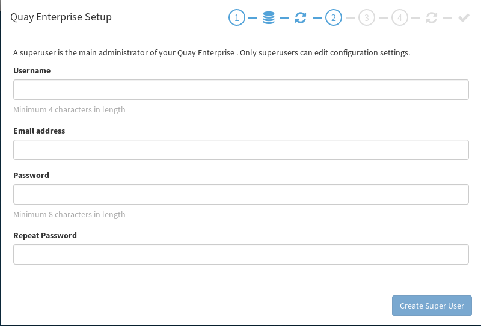
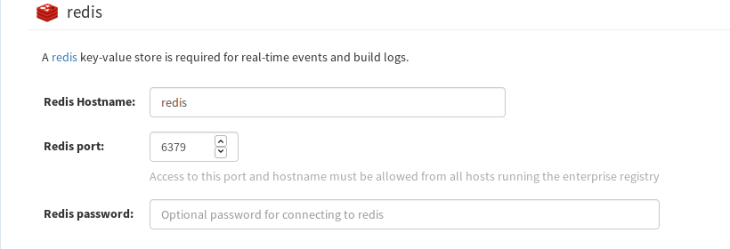

# Pre Requicstics

- vagrant > 2.0.2
- git
- virtualbox


# Documentation

- [Red Hat Guide for this VM](https://access.redhat.com/documentation/en-us/red_hat_quay/2.9/pdf/deploy_red_hat_quay_-_basic/Red_Hat_Quay-2.9-Deploy_Red_Hat_Quay_-_Basic-en-US.pdf)

- [Red Hat Quay Documentation](https://access.redhat.com/documentation/en-us/red_hat_quay/2.9/html-single/use_red_hat_quay/)

- [Authenticating against quay.io with test credentials](https://access.redhat.com/solutions/3533201)

- [CoreOS Documentation](https://coreos.com/quay-enterprise/docs/latest/)

# Create VM

```bash
vagrant up
```

# Completing guided setup

Browse to https://192.168.33.11.nip.io/setup

configure the following details

- Database Type: Postgres
- Database Server: postgresql
- Username: quay
- Password: quay123
- Database Name: quay



click "Validate Database Settings"

Click "Restart Container" when Database setup is complete



refresh until you get the super user screen

Create a super user

Username, Email address and password required




# Server configuration

## Redis Configuration

Redis Hostname: redis

Click save configuration and then click "Restart Container" and refresh




# configure Local docker to trust registry
copy /root/rootCA.pem from the VM to docker and add the quay registry to your local docker
add registry as trusted registry

```bash
sudo mkdir -p /etc/docker/certs.d/192.168.33.11.nip.io/
sudo cp rootCA.pem /etc/docker/certs.d/192.168.33.11.nip.io/ca.crt
sudo systemtl daemon-reload
sudo systemctl restart docker.service
# Verify login with super user credentials you created during setup
sudo docker login 192.168.33.11.nip.io
```
